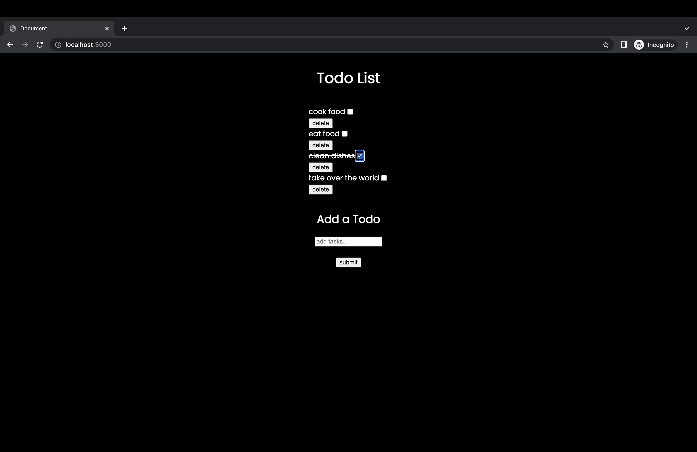

# nodejs-todo

simple todo app using nodejs/express, EJS, and JSON as a "database"



### Getting Started

1. Clone or download this repository.

   ```sh
   git clone https://github.com/kristiankauffeld/nodejs-todo
   cd nodejs-todo
   ```

2. Install dependencies in the project directory.

   ```sh
   npm install
   ```

3. Start the server at localhost:3000.

   ```sh
   npm start
   ```
